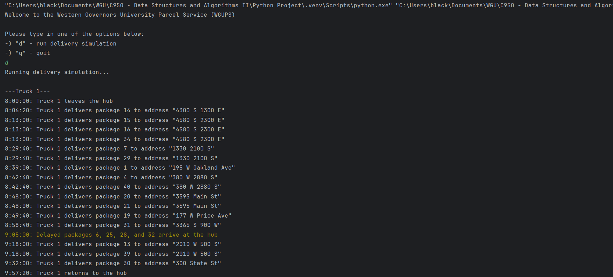
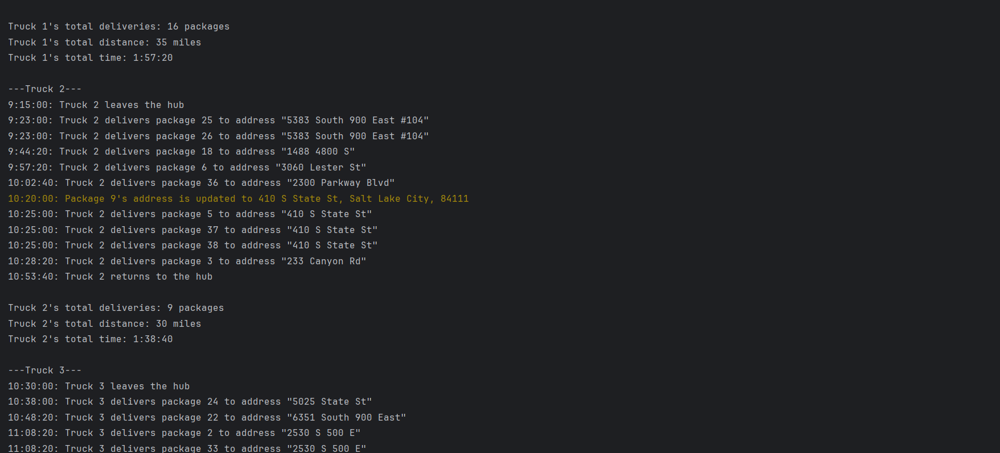
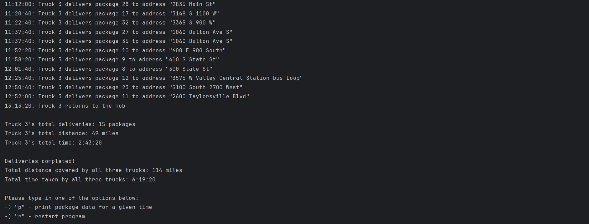
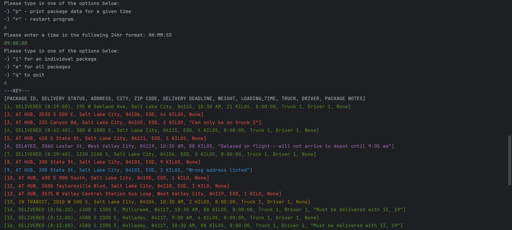
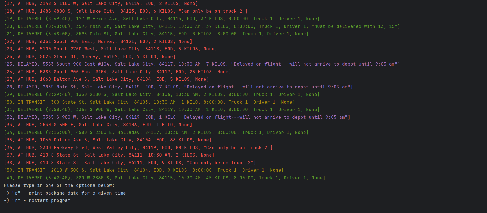
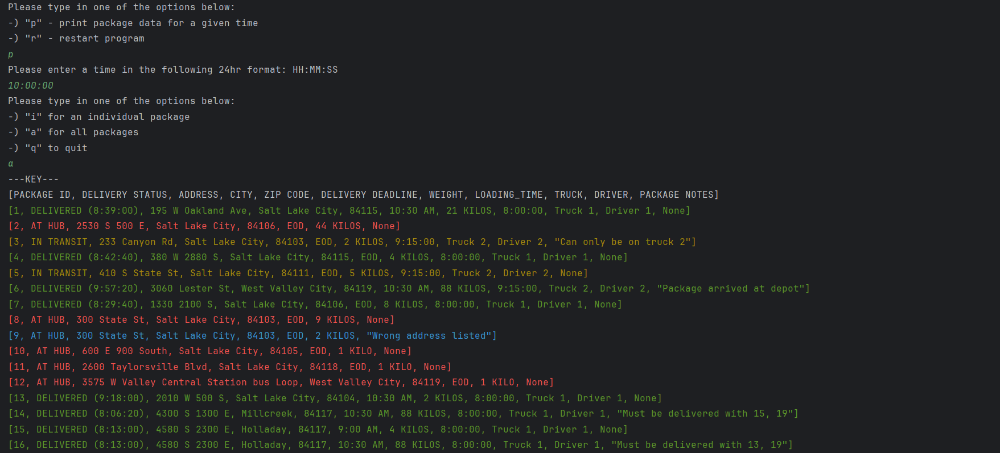
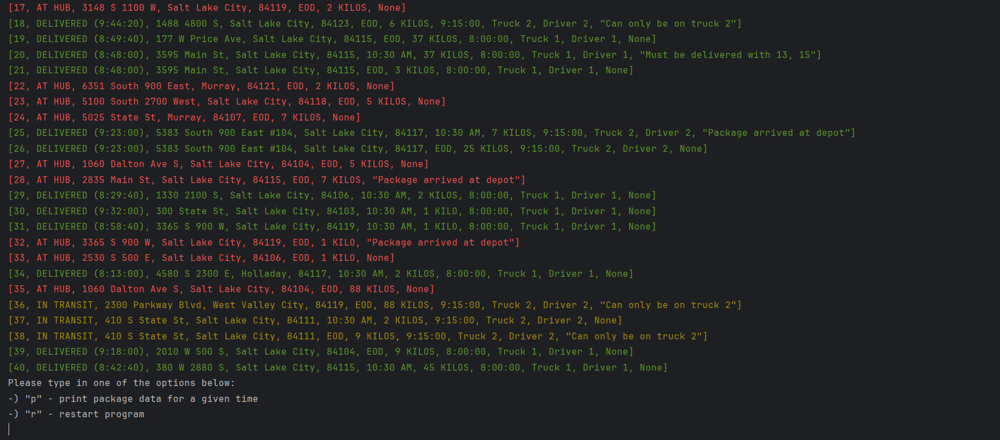
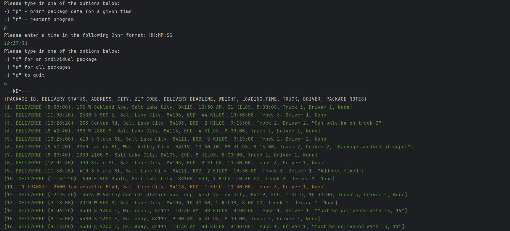
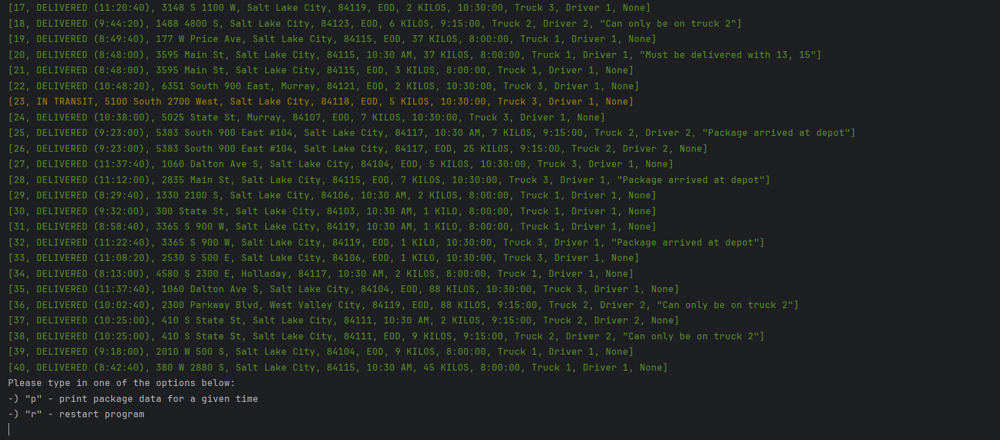

A Python project that I developed for my WGU Data Structures and Algorithms class. It consists of a hypothetical scenario where three delivery trucks need to deliver all their packages across the Salt Lake City area by a certain time. Additional requirements are added to certain packages that increase the difficulty of the delivery process and as a result, create greater code complexity. The code implements a simple "nearest-neighbor" algorithm to allow for the trucks to deliver the packages in time without resulting in unreasonable code complexity or route calculation times. A custom HashMap was also created to contain and keep track of the packages.

- <b>[Video Walkthrough](https://youtu.be/eK48pN8pxvc)</b>

This program runs on JetBrains PyCharm. The steps to running this program are as follows:
1. Open PyCharm, clone this repository, and run the Main.py file as usual.
2. The program will display a greeting message ("Welcome to the Western Governors University Parcel Service (WGUPS)") and will prompt the user to type in a "d" to run the delivery simulation or a "q" to quit the program. Typing in any other input will display an error message and loop the menu. "q" will display "Have a Nice Day :)" and will exit the program. "d" will run the delivery simulation, which will display timestamps for every package delivered by trucks 1, 2, and 3, respectively, followed by the total deliveries, distance, and time data for each truck. After this, the overall time and delivery data is displayed and the system prompts the user to select another option.

3. Typing in an erroneous input loops the prompt. Typing in an "r" restarts the program from scratch. Typing in "p" will allow the user to print out package data for a time the program will prompt for. After receiving a validly formatted 24hr time, the program will prompt the user for an "i" (which will print data for one package), "a" (which will print data for all packages), or "q" (which will cancel the print). Typing an incorrect letter will loop the prompt. If the user selects "a", the program will print data for all 40 packages, including data for package number/ID, delivery status, address, city, zip code, delivery deadline, weight, loading time, truck number, driver number, and special notes. The printed data is also color-coded for the status of each package (Delayed = Purple, Wrong Address = Blue, At Hub = Red, In Transit = Yellow, and Delivered = Green). Delivered packages also include the timestamp of when they were delivered. If the user selects "i", the program will prompt them for a package number. Invalid numbers will loop the prompt; a valid number will print all of the aforementioned data for the single package at the given time. After printing the package data, the program will prompt the user to either print the package data again for a different time or restart the entire program from scratch. Once again, any invalid inputs will loop the prompt.

 
 
Package Data at 9:00 AM:

Package Data at 10:00 AM:

Package Data at 12:37 PM:

